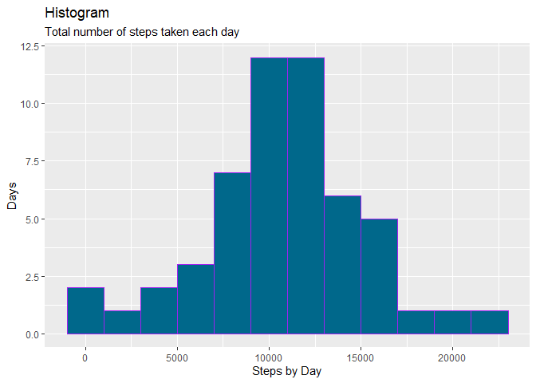

## Previus configs
  * Done


## Installing libraries

  * Done

## Loading and preprocessing the data

```r
unzip("activity.zip")
df <- read.csv2(file="activity.csv",na.strings = "NA",skip = 0,sep = ",")
```


## What is mean total number of steps taken per day?

1. Calculate the total number of steps taken per day

```r
date_steps <-
  df %>%
  group_by(date) %>%
  summarize(steps_by_day = sum(steps))
date_steps$date <- as.POSIXct(date_steps$date)
summary(date_steps)
```

```
##       date                      steps_by_day  
##  Min.   :2012-10-01 00:00:00   Min.   :   41  
##  1st Qu.:2012-10-16 00:00:00   1st Qu.: 8841  
##  Median :2012-10-31 00:00:00   Median :10765  
##  Mean   :2012-10-30 23:32:27   Mean   :10766  
##  3rd Qu.:2012-11-15 00:00:00   3rd Qu.:13294  
##  Max.   :2012-11-30 00:00:00   Max.   :21194  
##                                NA's   :8
```

2. Make a histogram of the total number of steps taken each day


```r
g<-ggplot(data=date_steps,aes(x=steps_by_day) )
g+geom_histogram(binwidth = 2000,color = "purple", fill="deepskyblue4")+labs(x = "Steps by Day",y="Days", title = "Histogram",subtitle = "Total number of steps taken each day")
```

<!-- -->

3. Calculate and report the mean and median of the total number of steps taken per day
 + mean

```r
mean(date_steps$steps_by_day,na.rm = TRUE)
```

```
## [1] 10766.19
```
 + median

```r
median(date_steps$steps_by_day,na.rm = TRUE)
```

```
## [1] 10765
```


## What is the average daily activity pattern?


## Imputing missing values


## Are there differences in activity patterns between weekdays and weekends?


```r
#Return warn original values
options(warn = defaultW)
```

