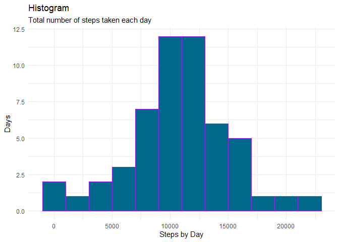
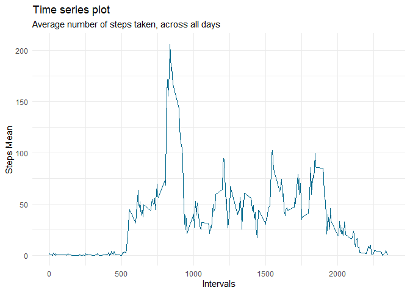
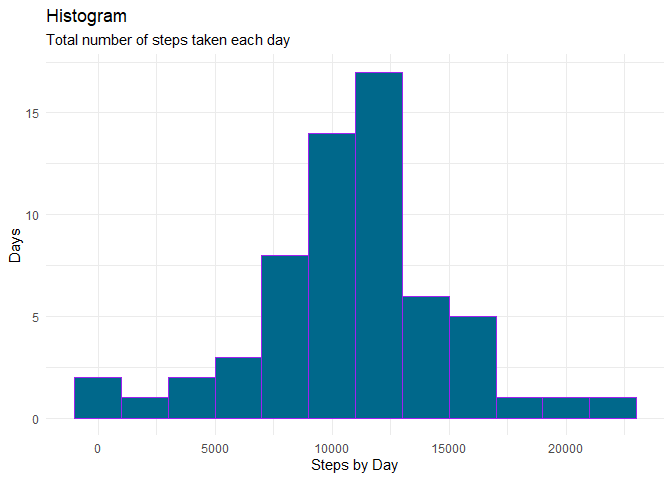
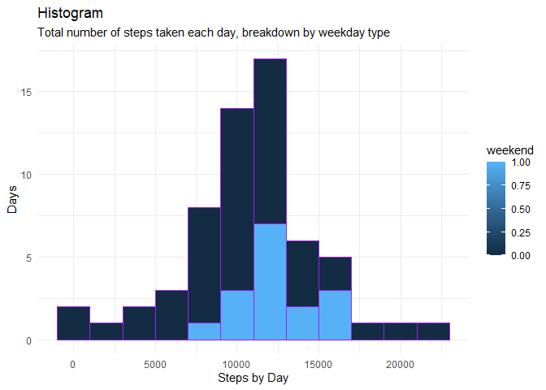

## Previus configs
  * Done


## Installing libraries

  * Done

## Loading and preprocessing the data

```r
unzip("activity.zip")
df <- read.csv2(file="activity.csv",na.strings = "NA",skip = 0,sep = ",")
df$date <- as.POSIXct(df$date)
#%u Monday is 1
df$weekday <- format(df$date,format="%u")
df_cc <- df[complete.cases(df),]
df_cc$date <- as.POSIXct(df_cc$date)
df_cc$weekday <- format(df_cc$date,format="%u")
```


## What is mean total number of steps taken per day?

1. Calculate the total number of steps taken per day

```r
date_steps <-
  df %>%
  group_by(date) %>%
  summarize(steps_by_day = sum(steps))
date_steps$date <- as.POSIXct(date_steps$date)
summary(date_steps)
```

```
##       date                      steps_by_day  
##  Min.   :2012-10-01 00:00:00   Min.   :   41  
##  1st Qu.:2012-10-16 00:00:00   1st Qu.: 8841  
##  Median :2012-10-31 00:00:00   Median :10765  
##  Mean   :2012-10-30 23:32:27   Mean   :10766  
##  3rd Qu.:2012-11-15 00:00:00   3rd Qu.:13294  
##  Max.   :2012-11-30 00:00:00   Max.   :21194  
##                                NA's   :8
```

2. Make a histogram of the total number of steps taken each day


```r
g<-ggplot(data=date_steps,aes(x=steps_by_day) )
g+geom_histogram(binwidth = 2000,color = "purple", fill="deepskyblue4")+labs(x = "Steps by Day",y="Days", title = "Histogram",subtitle = "Total number of steps taken each day")+theme_minimal()
```

<!-- -->

3. Calculate and report the mean and median of the total number of steps taken per day
 + mean

```r
mean(date_steps$steps_by_day,na.rm = TRUE)
```

```
## [1] 10766.19
```
 + median

```r
median(date_steps$steps_by_day,na.rm = TRUE)
```

```
## [1] 10765
```


## What is the average daily activity pattern?
1. Make a time series plot (i.e.type = "l") of the 5-minute interval (x-axis) and the average number of steps taken, averaged across all days (y-axis)


```r
# df_cc is a complete_cases data.fram of df
date_interval <-
  df_cc %>%
  group_by(interval) %>%
  summarize(steps_avg = mean(steps))

g<-ggplot(data=date_interval,aes(x=interval,y=steps_avg))
g+geom_line(linetype="solid",color="deepskyblue4")+theme_minimal()+labs(x = "Intervals",y="Steps Mean", title = "Time series plot",subtitle = "Average number of steps taken, across all days")
```

<!-- -->


2. Which 5-minute interval, on average across all the days in the dataset, contains the maximum number of steps?


```r
date_interval[which.max(date_interval$steps_avg),]
```

```
## # A tibble: 1 x 2
##   interval steps_avg
##      <int>     <dbl>
## 1      835      206.
```


## Imputing missing values

1. Calculate and report the total number of missing values in the dataset (i.e. the total number of rows with NAs)

```r
#~
count(df[!complete.cases(df),])
```

```
##      n
## 1 2304
```


2. Devise a strategy for filling in all of the missing values in the dataset. The strategy does not need to be sophisticated. For example, you could use the mean/median for that day, or the mean for that 5-minute interval, etc.


```r
day_name_interval <-
  df_cc %>%
  group_by(weekday,interval) %>%
  summarize(steps_avg = mean(steps))
```

We're doing an approach based on *day of the week* and the *minute* interval,using mean. 
**df_cc** is a complete_cases data.frame of **df**

3. Create a new dataset that is equal to the original dataset but with the missing data filled in.

```r
# we will create a new dataframe (df_filled) and a new column (steps_nona)
df_filled <- merge(df,day_name_interval,by.x=c("weekday","interval"),by.y=c("weekday","interval"))
df_filled$steps_nona <- df_filled$steps
df_filled[is.na(df_filled$steps_nona),c("steps_nona")] <- df_filled[is.na(df_filled$steps_nona),c('steps_avg')]
```


4. Make a histogram of the total number of steps taken each day and Calculate and report the mean and median total number of steps taken per day. Do these values differ from the estimates from the first part of the assignment? What is the impact of imputing missing data on the estimates of the total daily number of steps?


```r
date_steps_2 <-
  df_filled %>%
  group_by(date) %>%
  summarize(steps_by_day = sum(steps_nona))
date_steps_2$date <- as.POSIXct(date_steps_2$date)

g<-ggplot(data=date_steps_2,aes(x=steps_by_day) )
g%>%
+geom_histogram(binwidth = 2000,color = "purple", fill="deepskyblue4")%>%
+labs(x = "Steps by Day",y="Days", title = "Histogram",subtitle = "Total number of steps taken each day")%>%
+theme_minimal()
```

<!-- -->

```r
#+geom_vline(xintercept = mean(date_steps$steps_by_day))%>%
#+geom_vline(xintercept = median(date_steps$steps_by_day))
```

 + mean
 

```r
 mean(date_steps_2$steps_by_day)
```

```
## [1] 10821.21
```

```r
# This value hasn't changed a lot but now is greater
```
 
 + median 
 

```r
 median(date_steps_2$steps_by_day)
```

```
## [1] 11015
```

```r
# This value changed and now reflects a more accurate value
```


## Are there differences in activity patterns between weekdays and weekends?

```r
df_filled$weekend <- 0
df_filled[df_filled$weekday %in% c(6,7),"weekend"] <- 1
date_steps_3 <-
  df_filled %>%
  group_by(date,weekend) %>%
  summarize(steps_by_day = sum(steps_nona))
date_steps_3$date <- as.POSIXct(date_steps_3$date)

g<-ggplot(data=date_steps_3,aes(x=steps_by_day,group=weekend,fill=weekend) )
g%>%
+geom_histogram(binwidth = 2000,color = "purple")%>%
+labs(x = "Steps by Day",y="Days", title = "Histogram",subtitle = "Total number of steps taken each day, breakdown by weekday type")%>%
+theme_minimal()
```

<!-- -->

The weekend days show average steps, on proportion the quantity of days correspond to the 2/7


```r
  df_filled %>%
  group_by(weekend) %>%
  summarize(mean_steps = mean(steps_nona),median_steps = median(steps_nona),quantile(steps_nona,probs =seq(0,1,.75)))
```

```
## # A tibble: 4 x 4
## # Groups:   weekend [2]
##   weekend mean_steps median_steps `quantile(steps_nona, probs = seq(0, 1, 0.75)~
##     <dbl>      <dbl>        <dbl>                                          <dbl>
## 1       0       35.6            0                                              0
## 2       0       35.6            0                                             16
## 3       1       43.1            0                                              0
## 4       1       43.1            0                                             32
```
+ the mean of week vs weekend shows a visible decrement on weekends
+ median is a curious value, most of days on average are 0, al least the first half of the **df_filled** dataset by each type of weekend factor


